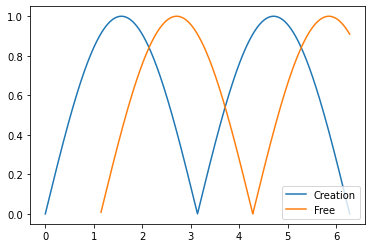
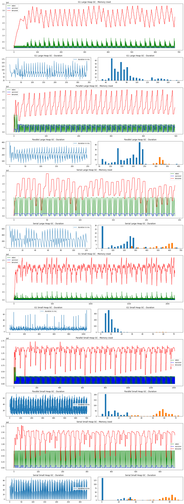

# HW04-gc

## Цель работы
Целью данного исследования было протестировать работу различных алгоритмов GC в JVM (OpenJDK) и разобраться в особенностях их работы.

## Описание тестового окружения, тестовой нагрузки

### Данные о системе
**OS:** 
Ubuntu 18.04.4 LTS / Linux 4.15.0-99-generic Ubuntu SMP x86_64 GNU/Linux 
**CPU:** 
Intel(R) Core(TM) i7-2620M CPU @ 2.70GHz / 2 cores, HT-off, PowerMgmt-off 
**MemTotal:** 
5983308 kB, Swap-off 
**OpenJDK:** 
Openjdk version "13.0.2" 2020-01-14  
OpenJDK Runtime Environment (build 13.0.2+8)  
OpenJDK 64-Bit Server VM (build 13.0.2+8, mixed mode, sharing)

### Описание алгоритма генерации нагрузки
Есть две активности:
* аллоцируются новые объекты фиксированного размера и добавляются в очередь;
* объекты удаляются из очереди, тем самым создавая мусор для работы GC;

Создание новых объектов представляет собой набор аллокаций блоками фиксированного размера (new byte[size]). Чтобы исключить линейность подаваемой нагрузки, кол-во аллокаций постоянно меняется.
Изменение кол-ва аллокаций происходит гармонически, по синусоиде.

Таким же образом происходит и удаление объектов (по другой синусоиде со сдвигом по отношению к первой). В результате я могу управлять тем как будут стареть объекты, в каком поколении (и в каком объеме) будут умирать - в young или old.

Ниже примерный график того, как подается нагрузка:

Данные для оси Y беру по модулю, поэтому такой график.

Кол-во объектов, которые я создаю (Creation) на первом шаге алгоритма определяется по функции sin(x), точнее по дельте от предыдущего значения Y. Поэтому вначале работы теста создается много новых объектов, потом (на пике) кол-во создаваемых объектов падает до нуля. При падении графика дельта начинает расти и соответственно растет кол-во создаваемых объектов.

Второй график идет со сдвигом. Он определяет кол-во удаляемых объектов. По форме он такой-же, поэтому кол-во создаваемых объектов равно количеству удаляемых. Но из-за смещения начала работы - объекты успевают состариться, попасть в другое поколение и там умереть. Также стоит отметить, что объект для удаления выбирается произвольно, чтобы создать фрагментацию в регионах и тем самым добавить работы сборщику мусора (т.к. G1 придется копировать/уплотнять).

## Описание тестов
Large Heap (LH): -Xms4096m -Xmx4096m 
Small Heap (SH): -Xms256m -Xmx256m 

### Список тестов:
* G1 LH, default pause target (200ms)
* G1 SH, default pause target (200ms)
* Parallel LH
* Parallel SH
* Serial LH
* Serial SH

## Запуск тестов / описание результатов

<table><tr><td><b>GC Name</b></td><td><b>Min GC (ms)</b></td><td><b>Max GC (ms)</b></td><td><b>Mean GC (ms)</b></td><td><b>95% pct (ms)</b></td><td><b>Cpu time (s)</b></td><td><b>Wall time (s)</b></td></tr><tr><td>G1 Large Heap</td><td>32</td><td>181</td><td>76.65</td><td>144.0</td><td>508.1</td><td>472.457</td></tr><tr><td>Parallel Large Heap</td><td>61</td><td>402</td><td>203.79</td><td>323.0</td><td>399.0</td><td>348.166</td></tr><tr><td>Serial Large Heap</td><td>0</td><td>685</td><td>251.50</td><td>611.85</td><td>323.78</td><td>321.312</td></tr></table>

<table><tr><td><b>GC Name</b></td><td><b>Min GC (ms)</b></td><td><b>Max GC (ms)</b></td><td><b>Mean GC (ms)</b></td><td><b>95% pct (ms)</b></td><td><b>Cpu time (s)</b></td><td><b>Wall time (s)</b></td></tr><tr><td>G1 Small Heap</td><td>1</td><td>75</td><td>9.54</td><td>17.0</td><td>68.33</td><td>53.504</td></tr><tr><td>Parallel Small Heap</td><td>5</td><td>73</td><td>29.41</td><td>64.0</td><td>63.73</td><td>46.244</td></tr><tr><td>Serial Small Heap</td><td>0</td><td>91</td><td>34.57</td><td>84.0</td><td>37.01</td><td>35.514</td></tr></table>

## Выводы

Протестировав 3 сборщика мусора под одинаковой нагрузкой и обработав полученные данные - можно сделать определенные выводы об их свойствах и особенностях работы.

Первое что хотелось бы отметить, что нет "старых/новых", "плохих/хороших" алгоритмов. Каждый из использованных GC оптимален для своих, конкретных задач. В связи с этим, было бы не корректно говорить, что какой-то GC лучше другого. Можно сказать, что один алгоритм может подходить лучше другого для определенной, конкретной нагрузки.

Это приводит нас к выводу, что прежде чем выбирать GC, нужно изучить какой профиль нагрузки создает наше приложение и какие у нас ожидания по качеству обслуживания, а конкретнее - требования ко времени отклика и пропускной способности. Нам стоит определиться, что для нас важнее: пропускная способность или минимальные задержки. Готовы ли мы пожертвовать некоторым кол-вом ресурсов для достижения целевых показателей (например, памятью или временем работы на процессоре) и есть ли вообще у нас свободные ресурсы.

В процессе подготовки тестовой нагрузки я выяснила, что G1 GC не так уж и просто поставить в трудное положение. В целом алгоритм неплохо справляется с фрагментацией и большими объемами мусора. Он позволяет гибко управлять своими параметрами и адаптировать их к различным нагрузкам. Его можно настроить как на работу с задачами, которые требуют высокой пропускной способности, так и под задачи, которые имеют требования по максимально допустимому времени задержки. В связи с этим, его можно рассматривать как наиболее универсальный алгоритм среди протестированных. 

Также стоит обратить внимание, что Serial GC может показать более высокую пропускную способность по сравнению с Parallel GC даже в тех системах, где есть больше одного вычислительного ядра. Например, в моей системе тесты выполнялись на двухядерном CPU. Такие результаты связаны с тем, что реализация этого GC проще и на небольших размерах heap-а, Serial GC может в один поток собрать мусор быстрее, чем Parallel GC. Parallel GC не успевает раскрыть свои преимущества при небольших размерах heap-а и малом кол-ве ядер. Алгоритм сложнее и требует больше синхронизаций для своей работы, а также активности по планированию параллельной сборки мусора, что в итоге не окупается на малом объеме работы.

Каждый алгоритм GC имеет свои издержки: G1 тратит cpu, serial/parallel жертвуют временем отклика системы. В связи с этим нужно четко понимать, чего мы хотим добиться и чем готовы пожертвовать.

Например, если для нас важно время отклика на каждый индивидуальный запрос, то нам не подойдут Serial/Parallel GC, т.к. из-за больших STW-задержек мы не сможем достичь заявленной цели. В этом случае нам больше подойдут конкурентные версии алгоритмов GC, такой, как G1 GC. Но нам придется заплатить за низкие задержки, временем работы приложения, т.к. конкурентная работа GC украдет время выполнения у нашего приложения. Эту же особенность можно выразить и другими словами - G1 GC и другие конкурентные алгоритмы смогут хорошо себя проявить и принести максимальную пользу, если у нас есть свободные циклы CPU. Тогда мы сможем и минимизировать время задержки и не пожертвовать временем работы приложения.

Если среднее время обработки запроса для нас важнее, чем время обработки индивидуального запроса (например, нас устроит какой-то процентиль, например 85-90% запросов выполняются быстро), то можно рассмотреть Parallel/Serial GC, т.к. они могут показать более оптимальные результаты.

Если время CPU у нас ограничено и нам не так важны задержки, то для этого класса нагрузки лучше подойдут Serial/Parallel GC, т.к. они не будут красть время у нашего приложения и смогут быстрее собирать мусор во время STW-пауз. При этом приложение не сможет помешать алгоритму и не понадобится дополнительная работа по remarking и т.п.

Таким образом, выбирать GC и настраивать его необходимо с глубоким пониманием работы своего приложения и требований по ключевым параметрам производительности. G1 GC мне показался наиболее универсальным алгоритмом с гибкими настройками. Также он неплохо адаптируется под изменяющийся профиль нагрузки и может действовать в определенном окне оптимально, без дополнительного вмешательства. Но есть ряд задач для которых лучше подойдут другие алгоритмы: Serial или Parallel GC.
